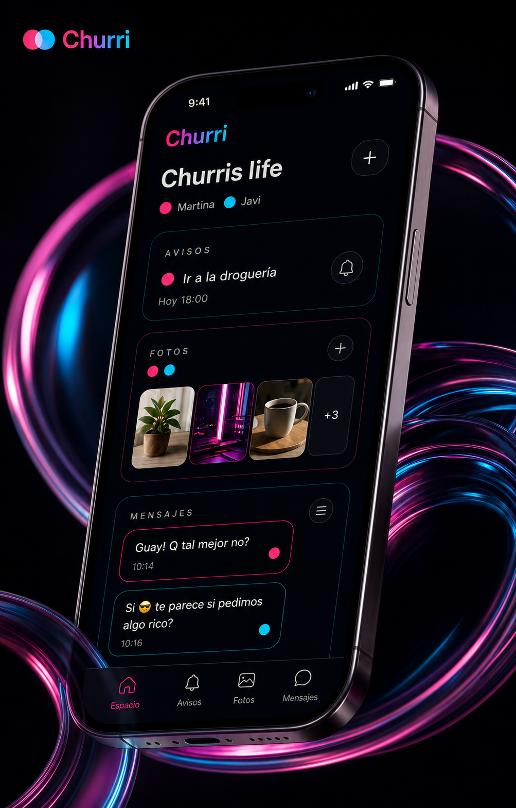
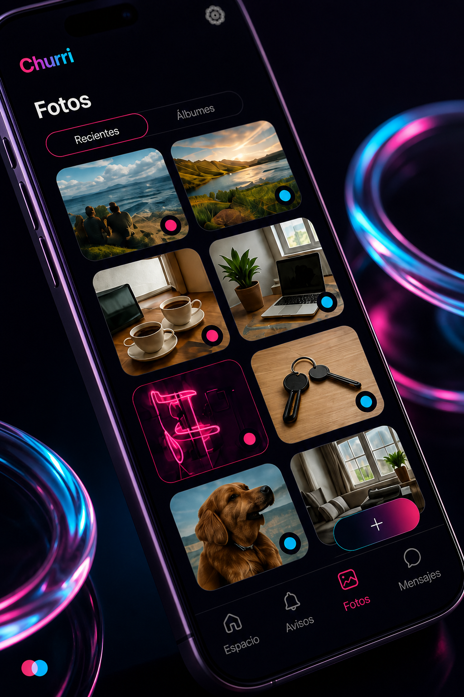
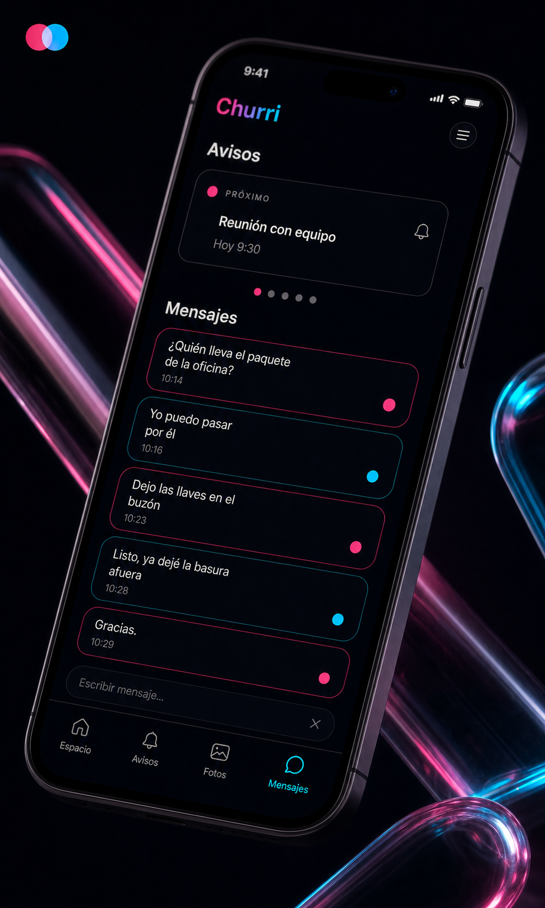

# Churri

**Un espacio privado para dos personas.**

<p align="center">
  
  
  
</p>

Churri es una aplicación móvil (Expo / React Native) que crea un espacio digital compartido entre dos personas. No hay feed, no hay audiencia, no hay nadie más: se entra con una llave que solo tiene la otra persona, y todo lo que hay dentro es de los dos.

El proyecto está construido con especial atención a la seguridad y a la coherencia del sistema de diseño: cada decisión de arquitectura —desde cómo se firman las subidas de fotos hasta cómo se cifra la sesión en disco— está tomada para que la privacidad no dependa de la buena fe de un cliente, sino de reglas verificables en el servidor.

---

## Arquitectura

```
App (Expo / React Native)
  │
  ├── Firebase Auth ──────── registro y login
  ├── Cloud Firestore ────── datos de pareja, avisos, fotos, mensajes
  ├── Cloudflare Worker ──── firma subidas/borrados, envía notificaciones push
  │       │
  │       └── Cloudinary ─── almacenamiento de fotos (modo authenticated)
  │
  └── Firebase Cloud Functions ─── limpieza de Cloudinary si una foto se borra fuera de la app
```

**Decisión clave:** el Worker de Cloudflare no usa una cuenta de servicio para leer Firestore — lee con el token del propio usuario. Esto significa que las Firestore Security Rules son la única fuente de autorización en todo el sistema; no existe una segunda capa de lógica de permisos que pueda desincronizarse de la primera.

### Flujo de datos

1. **Avisos**: se crean en Firestore; el teléfono de la otra persona programa una alarma local (`expo-notifications`) que se mantiene sincronizada en tiempo real.
2. **Fotos**: el cliente pide una firma de subida al Worker (que verifica el token de Firebase y la pertenencia al espacio) y sube directamente a Cloudinary; la API key de Cloudinary nunca llega al dispositivo.
3. **Mensajes**: el espacio conserva un máximo de cinco; al llegar el sexto se borra el más antiguo, para ambos a la vez.
4. **Notificaciones push**: la app llama al Worker, que verifica membresía antes de reenviar a la Expo Push API.

---

## Funcionalidades

**Avisos con hora exacta**
Un aviso suena en el móvil de la otra persona en el momento programado, con acciones directas desde la notificación ("Hecho" / "+30 min") y sin necesidad de abrir la app. Si el aviso lo merece, pasa al calendario con un toque.

**Fotos privadas**
Almacenamiento cifrado en tránsito y servido en modo `authenticated` en Cloudinary — sin enlaces públicos. Cada foto queda asociada al color de quien la subió.

**Chat de capacidad fija**
El espacio guarda solo los cinco últimos mensajes; el más antiguo se apaga cuando llega uno nuevo. El límite es de capacidad, no de frecuencia.

**Reacciones luminosas**
Seis señales animadas (parpadeo, chispazo, bengala, apagón, cortocircuito, fundido) para reaccionar a mensajes y fotos sin gastar un mensaje.

**Identidad por color**
Cada persona lleva un color fijo; todo lo que crea en el espacio lo lleva. La pareja elige su combinación entre seis paletas predefinidas (Neón, Brasa, Selva, Cobalto, Coral, Lima).

---

## Seguridad

- Acceso exclusivamente mediante una llave de 6 caracteres generada con `expo-crypto` (criptográficamente segura, no `Math.random`).
- Los espacios no son enumerables ni listables: las invitaciones son documentos independientes que solo permiten `get`, nunca `list`.
- Firestore Security Rules validan de forma estricta tipos, tamaños y transiciones de estado (por ejemplo, un espacio solo puede pasar de 1 a 2 miembros, y solo si el usuario que se une no pertenece ya a otro).
- El Worker de Cloudflare verifica cada petición contra las claves públicas de Google (JWKS) antes de firmar cualquier operación sobre Cloudinary.
- La sesión de Firebase se cifra con AES-256 antes de escribirse en disco; la clave vive en el Keychain/Keystore del sistema (`expo-secure-store`).
- Sin publicidad, sin analítica de terceros, sin venta de datos. Al eliminar la cuenta o salir del espacio, los datos y los archivos en Cloudinary se borran de forma efectiva.

---

## Stack tecnológico

| Capa | Tecnología |
|---|---|
| Framework | [Expo SDK 57](https://docs.expo.dev/versions/v57.0.0/) + React Native 0.86 |
| Lenguaje | TypeScript (strict mode) |
| UI | gluestack-ui v5, Tailwind CSS v4 (Uniwind), react-native-reanimated |
| Autenticación | Firebase Auth (email + Google Sign-In) |
| Base de datos | Cloud Firestore |
| Proxy de autorización | Cloudflare Workers |
| Almacenamiento de fotos | Cloudinary (modo authenticated) |
| Notificaciones push | Expo Push API |
| Backend serverless | Firebase Cloud Functions (Node 22) |
| Rutas | expo-router (file-based) |
| Plataforma | Android (Google Play) |

---

## Modelo de datos (Firestore)

```
users/{uid}                              couples/{coupleId}
  ├── email, displayName                   ├── memberIds: string[] (1 o 2)
  ├── coupleId | null                       ├── inviteCode: string
  └── expoPushToken?                        └── palette?

invites/{code}                           couples/{coupleId}/reminders/{id}
  ├── coupleId                             ├── title, dueAt, status
  └── createdAt                            └── createdByUid

couples/{coupleId}/photos/{id}           couples/{coupleId}/messages/{id}
  ├── imageUrl (Cloudinary, firmada)        ├── text (max 500)
  ├── uploadedByUid                         ├── senderId
  └── reactions: Map<uid, SignalId>         └── reactions: Map<uid, SignalId>
```

---

## Estructura del proyecto

```
churriapp/
├── src/
│   ├── app/                  # Screens (file-based routing)
│   │   ├── _layout.tsx       # Layout raíz (providers, guards, error boundary)
│   │   ├── settings.tsx      # Ajustes
│   │   ├── (tabs)/           # Tabs principales
│   │   │   ├── index.tsx     # Espacio (home)
│   │   │   ├── chat.tsx      # Mensajes
│   │   │   ├── gallery.tsx   # Fotos
│   │   │   └── reminders.tsx # Avisos
│   │   └── onboarding/       # Registro y emparejamiento
│   ├── components/           # UI atómica
│   │   ├── brand.tsx         # Logo, wordmark, GlowCard, botones
│   │   ├── app-tabs.tsx      # Barra de tabs inferior
│   │   ├── light-signals.tsx # Señales luminosas animadas
│   │   ├── message-light.tsx # Burbuja de mensaje animada
│   │   ├── reminder-alarms.tsx # Sincronizador de alarmas locales
│   │   └── ui/                # Componentes gluestack-ui
│   ├── context/
│   │   └── couple-context.tsx # Contexto principal (auth + pareja)
│   ├── hooks/                # Custom hooks
│   ├── lib/                  # Firebase, Cloudinary, push, auth, persistencia
│   └── constants/             # Tema, paletas, textos legales
├── worker/                   # Cloudflare Worker
├── functions/                # Firebase Functions
├── store/                    # Assets para Google Play
├── web/                      # Páginas de privacidad y eliminación de cuenta
└── assets/                   # Imágenes, iconos, fuentes
```

---

## Primeros pasos (desarrollo)

```bash
# Instalar dependencias
npm install

# Iniciar servidor de desarrollo
npx expo start
```

### Requisitos

- Node.js 22+
- Expo CLI
- Una cuenta de Firebase con proyecto configurado (Auth + Firestore)
- Una cuenta de Cloudinary
- Una cuenta de Cloudflare (para el Worker)

---

## Licencia

Todos los derechos reservados © 2026 We Are Capa / Miguel Varona Gallego.

El código de este repositorio es público para su revisión (portfolio), pero no está bajo una licencia de código abierto: no está permitido su uso, copia, modificación o redistribución sin autorización previa. Ver [LICENSE](LICENSE).

---

<p align="center">Churri — un espacio para dos.</p>
