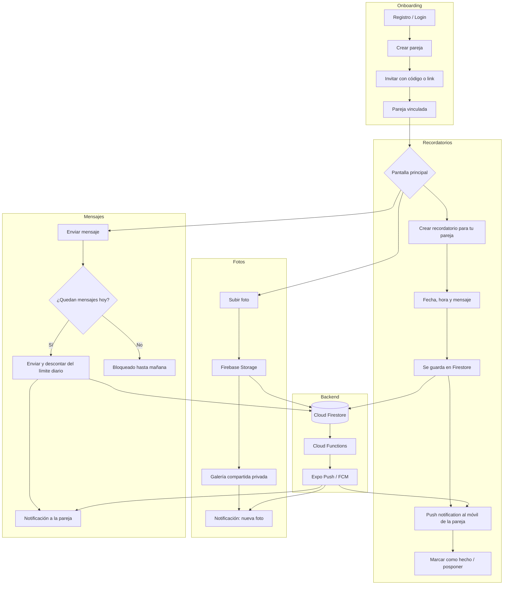
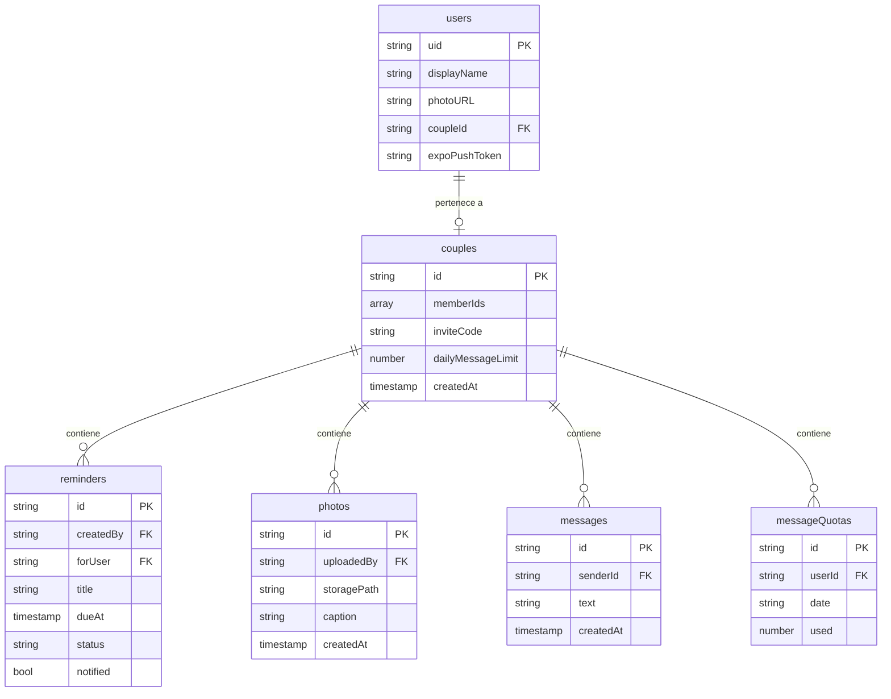

# Flare — Arquitectura (Firebase)

> **Documento histórico (pre-pivote).** Describe el diseño original para parejas y algunas
> decisiones que cambiaron después (Firebase Storage → Cloudinary + Worker; límite diario →
> capacidad fija de 5 mensajes). Desde julio de 2026 el modelo es de **espacios de 1 a 8
> personas** con avisos dirigidos: la referencia actual es el [README](../README.md) y la
> propuesta [propuesta-flare-2.0.md](propuesta-flare-2.0.md).

App móvil para parejas: recordatorios con push, galería de fotos compartida
y mensajes limitados por día.

## 1. Flujo de usuario



## 2. Servicios de Firebase

| Necesidad | Servicio |
|---|---|
| Registro / Login | **Firebase Auth** (email, Google, Apple) |
| Parejas, recordatorios, mensajes | **Cloud Firestore** |
| Fotos | **Firebase Storage** |
| Límite diario, disparar notificaciones | **Cloud Functions** |
| Recordatorios programados | **Cloud Scheduler** + Function |
| Privacidad (solo la pareja ve lo suyo) | **Security Rules** |
| Push | **expo-notifications** (recomendado) o FCM |

## 3. Modelo de datos (Firestore)

Firestore es NoSQL: no hay tablas ni JOINs. La regla de oro es
**anidar bajo `couples/{coupleId}`** para que las Security Rules sean simples:
"solo puedes leer/escribir si tu uid está en `memberIds`".



### Rutas de las colecciones

```
users/{uid}
couples/{coupleId}
couples/{coupleId}/reminders/{reminderId}
couples/{coupleId}/photos/{photoId}
couples/{coupleId}/messages/{messageId}
couples/{coupleId}/messageQuotas/{uid}_{YYYY-MM-DD}   ← contador diario
```

Storage: `couples/{coupleId}/photos/{photoId}.jpg`

## 4. Decisiones clave

**El límite diario se valida en el servidor, no en la app.**
El cliente puede mentir. `messageQuotas/{uid}_{fecha}` se incrementa desde una
Cloud Function (o una transacción con Security Rules que impidan `used > limit`).
El ID compuesto con la fecha hace que el contador se "resetee" solo cada día.

**Push con `expo-notifications`, no con FCM directo.**
FCM nativo (`@react-native-firebase/messaging`) obliga a development build y a
configurar APNs/FCM a mano. `expo-notifications` funciona sobre el servicio de
Expo, es mucho más simple, y desde una Cloud Function solo haces un POST a
`https://exp.host/--/api/v2/push/send`. El `expoPushToken` se guarda en `users/{uid}`.

**Cloud Functions requiere plan Blaze** (pago por uso). El free tier es amplio
(2M invocaciones/mes) pero pide tarjeta. Si quieres evitarlo al principio, el
límite diario se puede hacer solo con Security Rules y las notificaciones se
disparan desde el cliente que envía.

## 5. Pantallas (a diseñar)

- Login / Registro
- Crear o unirse a pareja (código de invitación)
- Home (resumen: próximos recordatorios, últimas fotos, mensajes sin leer)
- Recordatorios (lista + crear)
- Galería
- Chat (con contador de mensajes restantes visible)
- Ajustes / perfil
